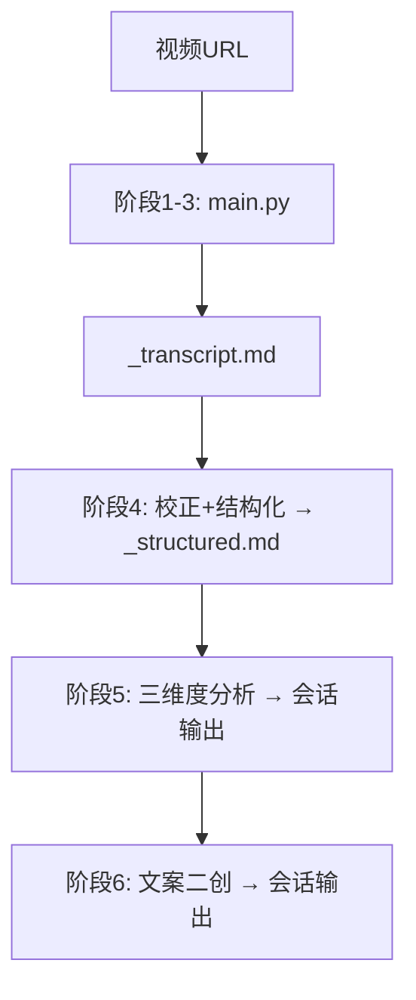

# video-copy-analyzer

支持 B站、YouTube、抖音 等平台的视频文案分析工具。

- **脚本层**: 视频下载 + 语音转录（平台转录 API）+ 生成文字稿
- **Agent 层**: LLM 校正结构化 + 三维度分析 + 文案二创

---

## 环境要求

```bash
brew install ffmpeg      # macOS
python scripts/check_environment.py  # 验证环境
```

---

## 工作流程



### 脚本层（main.py 自动完成）

```bash
python skills/video-copy-analyzer/main.py "<视频URL>"
```

- 阶段1: 下载视频（抖音用 `download_douyin.py`，其他平台用 yt-dlp）
- 阶段2: 平台转录 API 语音转录（`gpt-4o-mini-transcribe`）
- 阶段3: SRT 合并为 `canvas/{video_id}_transcript.md`

### Agent 层

**阶段4 — 校正 + 结构化**（一次 LLM）

读取 `_transcript.md`，输出 `canvas/{video_id}_structured.md`：
- 修正 ASR 同音字、专业术语、标点
- 按叙事段落切分，添加小标题（`## 一、xxx`）
- 关键金句**加粗**，保留口语风格

**阶段5 — 三维度分析**（会话输出）

读取 `_structured.md`，参照 `prompt/agent-analysis-guide.md` + `prompt/de-ai-guide.md`。

**阶段6 — 文案二创**（会话输出）

基于分析结论，参照 `prompt/copywriting-recreate.md` + `prompt/de-ai-guide.md`。

> ⚠️ **输出完整性要求**：所有会话输出必须完整，不得截断。
> 若内容较长，分段输出，每段结尾注明「未完待续」，直到全部输出完毕再结束。

---

## 输出文件

| 文件 | 生成者 |
|------|--------|
| `canvas/{video_id}_transcript.md` | 脚本（ASR直出）|
| `canvas/{video_id}_structured.md` | Agent |
| 三维度分析 + 文案二创 | Agent（会话输出）|

---

## Prompt 参考

| 文件 | 用途 |
|------|------|
| `prompt/agent-analysis-guide.md` | 三维度分析框架 |
| `prompt/de-ai-guide.md` | 去AI化写作风格 |
| `prompt/copywriting-recreate.md` | 文案二创指南 |

---

## 故障排除

| 问题 | 原因 | 解决 |
|------|------|------|
| API 401 | uid/token 失效 | 重新登录 OpenClaw |
| 转录超时 | 网络或限流 | 稍后重试 |
| 下载 403 | 平台风控 | 添加 cookies 或更换 IP |
| 链接失效 | 视频已删除 | 确认链接有效性 |
