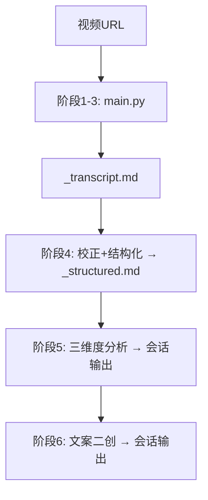

# video-copy-analyzer

支持 B站、YouTube、抖音 等平台的视频文案分析工具。

- **脚本层**: 视频转录 API（B站/YouTube，支持 BibiGPT 或兼容服务）或视频下载+语音转录（抖音/本地文件）+ 生成文字稿
- **Agent 层**: LLM 校正结构化 + 三维度分析 + 文案二创

---

## 凭证配置

| 凭证 | 用途 | 是否必须 |
|------|------|----------|
| `video_transcript_api_key` | B站/YouTube 转录（无需下载视频） | **推荐** |
| `video_transcript_base_url` | 自定义 API 端点 | 可选（留空默认 BibiGPT） |

**支持的服务（BibiGPT 兼容接口）：**
- [BibiGPT](https://bibigpt.co/user/integration)（默认，支持 B站 + YouTube）
- 其他兼容 `/getPolishedText` 接口的视频转录服务

> 未配置 `video_transcript_api_key` 时，B站/YouTube 链接将降级为直接下载（可能因平台风控失败）。

---

## 环境要求

```bash
brew install ffmpeg      # macOS（仅抖音/本地文件需要）
python scripts/check_environment.py  # 验证环境
```

---

## 工作流程



### 脚本层（main.py 自动完成）

```bash
python skills/video-copy-analyzer/main.py "<视频URL>"
```

**B站/YouTube（配置了 BIBI_API_TOKEN）:**
- 阶段1: BibiGPT API 直接获取转录（跳过视频下载）→ SRT

**抖音/本地文件（或未配置 BIBI_API_TOKEN）:**
- 阶段1: 下载视频（抖音用 `download_douyin.py`，其他平台用 yt-dlp）
- 阶段2: 本地语音转录 → SRT

**所有路径最终汇合:**
- 阶段3: SRT 合并为 `canvas/{video_id}_transcript.md`

### Agent 层

**阶段4 — 校正 + 结构化**（一次 LLM）

读取 `_transcript.md`，输出 `canvas/{video_id}_structured.md`：
- 修正 ASR 同音字、专业术语、标点
- 按叙事段落切分，添加小标题（`## 一、xxx`）
- 关键金句**加粗**，保留口语风格

**阶段5 — 三维度分析**（会话输出）

读取 `_structured.md`，参照 `prompt/agent-analysis-guide.md` + `prompt/de-ai-guide.md`。

**阶段6 — 文案二创**（会话输出）

基于分析结论，参照 `prompt/copywriting-recreate.md` + `prompt/de-ai-guide.md`。

> ⚠️ **输出完整性要求**：所有会话输出必须完整，不得截断。
> 若内容较长，分段输出，每段结尾注明「未完待续」，直到全部输出完毕再结束。

---

## 输出文件

| 文件 | 生成者 |
|------|--------|
| `canvas/{video_id}_transcript.md` | 脚本（ASR直出）|
| `canvas/{video_id}_structured.md` | Agent |
| 三维度分析 + 文案二创 | Agent（会话输出）|

---

## Prompt 参考

| 文件 | 用途 |
|------|------|
| `prompt/agent-analysis-guide.md` | 三维度分析框架 |
| `prompt/de-ai-guide.md` | 去AI化写作风格 |
| `prompt/copywriting-recreate.md` | 文案二创指南 |

---

## 故障排除

| 问题 | 原因 | 解决 |
|------|------|------|
| `未配置 BIBI_API_TOKEN` | 凭证未填写 | 在 Agent 设置 → 凭证中填入 BibiGPT API Key |
| BibiGPT 401 | API Key 无效 | 检查 bibigpt.co/user/integration 中的 Key |
| BibiGPT 402 | 配额用完 | 访问 bibigpt.co/shop 充值 |
| BibiGPT 内容为空 | 视频无字幕或不受支持 | 确认视频有字幕（B站AI字幕或官方字幕） |
| 下载 403/412 | 平台风控（未用 BibiGPT 时） | 配置 BIBI_API_TOKEN 改走 API 路径 |
| 转录超时 | 网络问题 | 稍后重试 |
| 链接失效 | 视频已删除 | 确认链接有效性 |
