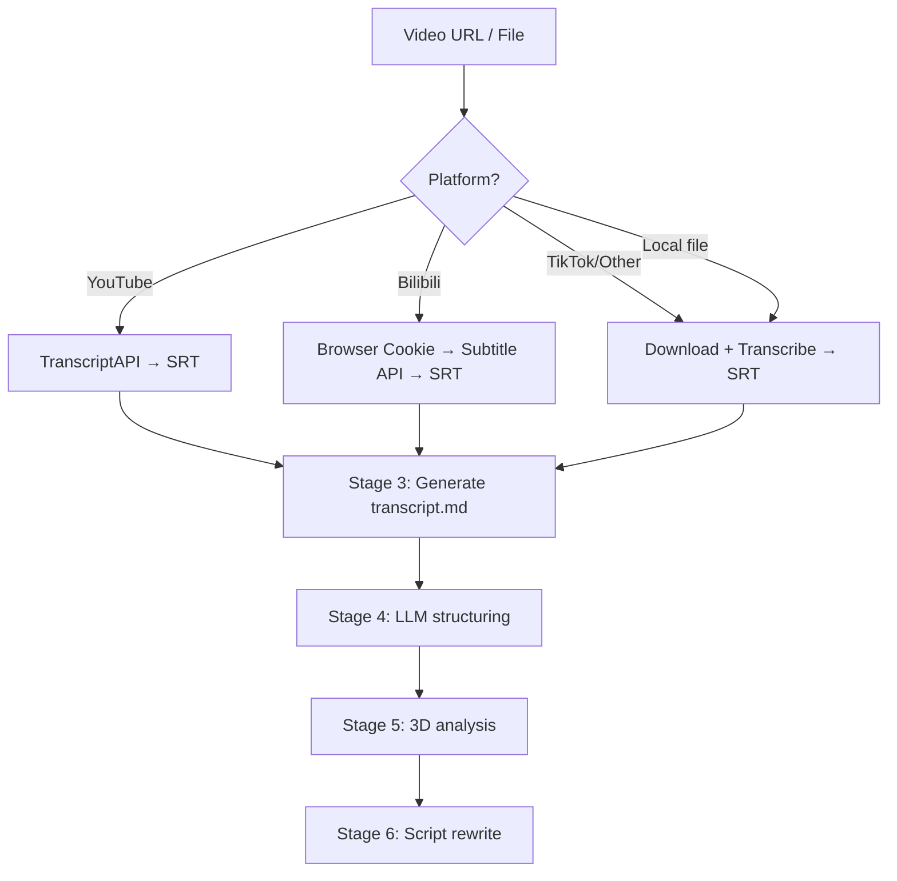

# video-copy-analyzer

Supports YouTube, Bilibili, TikTok/Douyin, and local video files.

- **Script layer**: YouTube caption API / Bilibili browser cookie / local download+transcribe
- **Agent layer**: LLM structuring + 3-dimension analysis + script rewrite

---

## Credentials

| Credential | Platform | Required | Get it |
|---|---|---|---|
| `youtube_transcript_api_key` | YouTube | Yes (for YouTube) | [transcriptapi.com](https://transcriptapi.com) — free 100 req/month |

**Bilibili:** No extra credential needed — just make sure Chrome is logged in to bilibili.com
**TikTok / Local files:** No credentials needed

---

## Environment

```bash
brew install ffmpeg      # macOS only — needed for TikTok/local files
python scripts/check_environment.py  # verify setup
```

---

## Workflow



### Script layer (main.py runs automatically)

```bash
python skills/video-copy-analyzer/main.py "<video_url>"
```

**YouTube:**
- Stage 1: TranscriptAPI fetches captions → timestamped SRT (no video download)

**Bilibili:**
- Stage 1: Read SESSDATA from Chrome → Bilibili subtitle API → SRT

**TikTok / Other URL / Local file:**
- Stage 1: Download video
- Stage 2: Local audio transcription → SRT

**All paths converge:**
- Stage 3: SRT → `canvas/{video_id}_transcript.md`

### Agent layer

**Stage 4 — Structure** (1 LLM call)
Read `_transcript.md` → output `canvas/{video_id}_structured.md`:
- Fix ASR errors, homophone mistakes, punctuation
- Split into narrative sections with headers
- Bold key quotes, preserve spoken style

**Stage 5 — 3-dimension analysis** (conversation output)
Read `_structured.md`, follow `prompt/agent-analysis-guide.md` + `prompt/de-ai-guide.md`.

**Stage 6 — Script rewrite** (conversation output)
Follow `prompt/copywriting-recreate.md` + `prompt/de-ai-guide.md`.

> ⚠️ **Output completeness**: All outputs must be complete — no truncation.
> If long, output in parts ending with "to be continued" until fully done.

---

## Output files

| File | Generated by |
|---|---|
| `canvas/{video_id}_transcript.md` | Script (raw transcript) |
| `canvas/{video_id}_structured.md` | Agent |
| 3D analysis + script rewrite | Agent (conversation output) |

---

## Prompt references

| File | Purpose |
|---|---|
| `prompt/agent-analysis-guide.md` | 3-dimension analysis framework |
| `prompt/de-ai-guide.md` | Anti-AI writing style guide |
| `prompt/copywriting-recreate.md` | Script rewrite guide |

---

## Troubleshooting

| Issue | Cause | Fix |
|---|---|---|
| `YouTube Transcript API key not configured` | Missing credential | Add `youtube_transcript_api_key` in Agent Settings → Credentials |
| TranscriptAPI 401 | Invalid key | Check your key at transcriptapi.com |
| TranscriptAPI 402 | Quota exceeded | Upgrade plan at transcriptapi.com |
| No transcript found (YouTube) | Video has no captions | Try a different video with CC enabled |
| B站 cookie not found | Not logged in to Bilibili in Chrome | Log in at bilibili.com in Chrome and retry |
| B站 no subtitle | Video has no AI subtitle | Only videos with AI subtitles are supported |
| Link expired / invalid | Video deleted | Verify the URL is valid |
